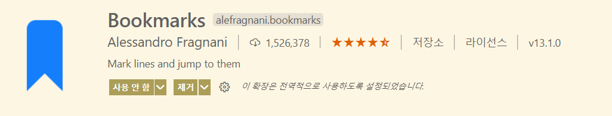
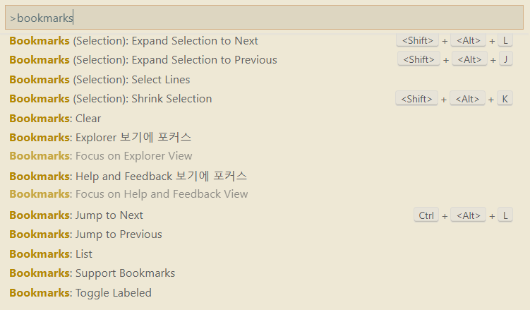
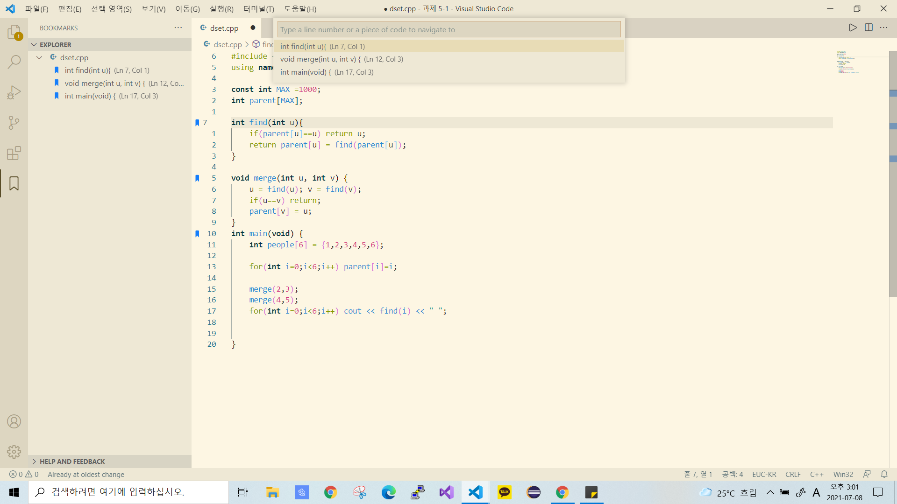

#  BookMarks

추천하는 VScode Extention는 Bookmarks 입니다!! 
흔히 아는 책갈피 기능을 합니다.
## 기능
- Mark/unmark positions in your code
- Mark positions in your code and give it name
- Jump forward and backward between bookmarks
- Icons in gutter and overview ruler
- See a list of all Bookmarks in one file and project
- A dedicated Side Bar
  
 

