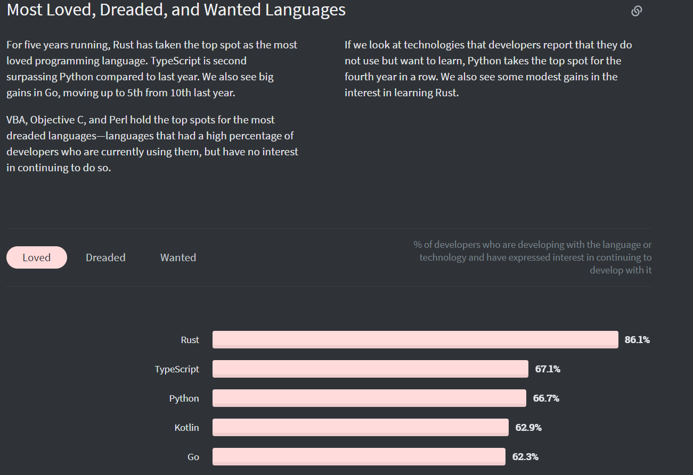

# Rust

Rust는 Stack Overflow Survey 에서 4년 연속 가장 사랑 받는 언어이다. 이유를 알고자 만들어 보았다.
## 탄생
---
Rust는 모질라(Mozilla) 재단에서 만들어졌다. 모질라 재단은 파이어 폭스를 만든 회사이다. C++를 대체하고 싶어서 만들었다고 한다. c/c++과 경쟁 관계이다.
## 특징
---
"안전하고, 병렬적이며, 실용적인 언어" 로 디자인되었다.

순수 함수형, 액터 기반 병령, 명령형 객체 지향 프로그래밍 스타일들을 지원한다.
## 강점
---
1. Memory Safe
    - 메모리를 수동으로 관리할 수 있고, Rust 컴파일러는 이 부분에서 엄격하여 메모리 오류가 일어날 수 있다면 작동을 하지 않는다.
    - 절대로 실패하면 안되는 소프트웨어를 만들 때 유용하다.
2. Morden
    - 최신 프로그래밍 기법을 사용할 수 있다. (함수형 프로그래밍 요소, 패키지 매니저 Cargo)
    - 병행성(Concurrency), 병렬성(Parallelism)을 갖고 있다.
    - WebAssembly 로도 컴파일이 가능하다
3. Speed
    - 속도와 성능 면에서 c/c++과 비슷하다. 뛰어넘는 것을 목표로 삼는다.
## 강한 분야
---
시스템 프로그래밍, 임베디드 시스템 프로그래밍 
