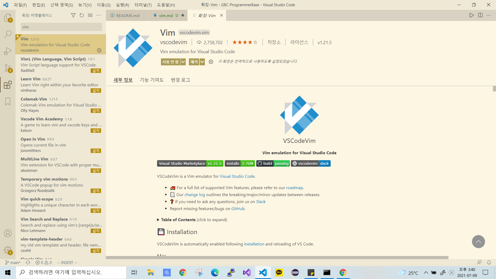

# 🌊Vim🌊
- VSCode에 Vim 단축키를 적용해서 사용하면 마우스를 덜 사용할 수 있게 됩니다.


## VSCode에서 Vim Extention 설치하기

- 확장 페이지에 들어가 vim 을 검색해서 설치하면 됩니다.

## Vim 단축키 설정
```c
{
  ...
  "editor.lineNumbers": "relative",
  "vim.useSystemClipboard": true,
  "vim.useCtrlKeys": true,
  "vim.hlsearch": true,
  "vim.handleKeys": {
      "<C-a>": false,
      "<C-d>": false,
      "<C-f>": false,
      "<C-n>": false,
      "<C-o>": false,
      "<C-w>": false,
      "<C-k>": false,
  },
  ...
}
```
- Vim 확장이 VSCode의 유용한 단축키를 덮어버릴 수도 있습니다. 방지하기 위해서 명령 팔레트를 열어서 setting json 만 검색하면 Preferences: Open Settings (JSON) 이 나옵니다. 이것을 실행하여 설정창이 뜨면 단순히 위의 설정을 복사해서 붙혀넣으면 됩니다.

<br>

## Vim 단축키
| 기능 | 단축키 |
| :- | :- |
| 명령 모드에서 이동(⬅⬇⬆➡) | `h` `j` `k` `l` |
| 입력하기 | `i` |
| 문장 처음에 입력하기 | `I` |
| 다음 글자에 입력 | `A` |
| 다음 행에 입력 | `o` |
| 잘라내기 | `x` |
| 단어 잘라내기 | `dx` |
| 문장 잘라내기 | `dd` |
| 커서부터 문장 끝까지 잘라내기 | `D` |
| 전체 선택 | `shift+v+g` |
| 이후 복사 | `y` |
| 이후 잘라내기 | `d` | 
| 한 글자 지우고 편집 | `r` |
| 단어 지우고 편집 | `cw` |
| 커서로부터 문장 끝까지 지우고 편집 | `C` |
| 단어 복사 | `yw` |
| 문장 복사 | `yy` |
| 붙여 넣기 | `p` |
| 문장의 처음으로 이동 | `0` |
| 문장의 끝으로 이동 | `$` |
| 원하는 문자로 이동 | `f <문자>`|
| 오른쪽 단어로 이동 | `e` |
| 왼쪽 단어로 이동 | `b` |
| 화면의 처음으로 이동 | `H` |
| 화면의 중앙으로 이동 | `M` |
| 화면의 마지막으로 이동 | `L` |
| 취소 | `u` |
| 취소한 것을 취소 | `ctrl+R` |
| 파일 마지막으로 이동 | `G` |
| N 번째 행으로 이동 | `N gg` |
| 커서 기준 화면 최대한 아래(위,중앙)으로 이동 | `zt zb zz` |
| 블록 드래그 | `ctrl+v` |
| 다중 입력 | `shift+i` |
| 일반 모드로 변경 | `ESC` |
| 저장 및 나가기 | `:wq` |