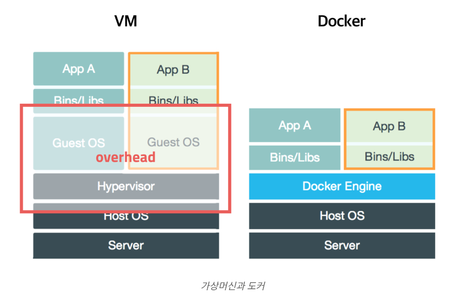
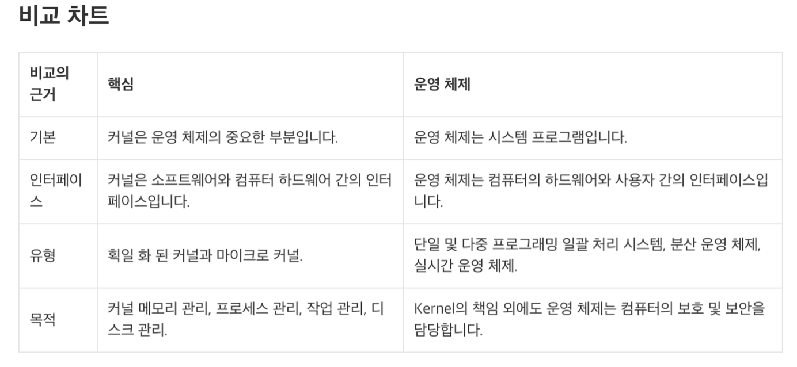
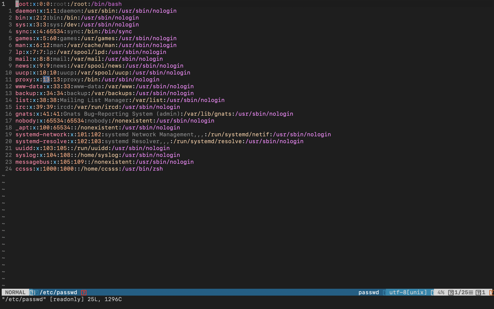

# Docker

Docker는 실행할 때마다 다른 계정이 생기는듯..?

Docker계정에서 만든 것들은 자체적인 directory가 없어 보이는데??
아니구나 다들 있네

아 /으로 시작하면 절대경로구나.

GUI는 graphical user interface. Command-line interface(CLI)는 반대

Mv command가 file자체를 움직일 수도 있지만 그냥 디렉토리나 파일의 이름을 바꾸는 역할로도 작용할 수 있구나.

File이름이 달라도 inode가 같으면 같은 파일!

심볼릭 링크와 하드링크의 다른점(심볼릭기준)

-	파일의 종류가 l로 표시
-	하드 링크의 개수가 증가하지 않는다.
-	파일 이름 뒤에 원본 파일의 이름이 표시된다.
-	Inode의 번호가 원본과 다름.

Docke의 경우 process를 가상화한다는 것인가?
Vm과 docker와 기존의 os를 가상화하는 방식은 어떤 차이..?

 
 

## Docker란?

Docker는 컨테이너 기반의 오픈소스 가상화 플랫폼이다.

‘컨테이너 기반의 오픈소스 가상화 플랫폼’이라는 단어를 철저히 분석해보면 가장 바람직하겠지만, 난 일단 container 기반이라는 것에 초점을 맞추어 보고 싶다.

이쯤에서 image에 대해서 언급하는 것이 적절해보이는데, image란 container와 짝꿍 같은 존재로 자바에서 class와 object같은 존재라고 볼 수 있다. (image : class , container : object)

어떤 블로그(https://cultivo-hy.github.io/docker/image/usage/2019/03/14/Docker%EC%A0%95%EB%A6%AC/
)에선 container를 설명하기 위해서 두 software를 실행해야 하는데 각각 software가 요구하는 환경이 다를 경우에 대해서 언급하고 있다.
 
그때에 ‘컨테이너(Container)는 개별 Software의 실행에 필요한 실행환경을 독립적으로 운용할 수 있도록 기반환경 또는 다른 실행환경과의 간섭을 막고 실행의 독립성을 확보해주는 운영체계 수준의 격리 기술을 말합니다. 컨테이너는 애플리케이션을 실제 구동 환경으로부터 추상화할 수 있는 논리 패키징 메커니즘을 제공합니다.’ 라고 한다.
즉, software가 자유롭게 실행될 수 있는 구동환경을 제공해준다는 것 같다.

 

## 이미지(Image)
이미지는 컨테이너 실행에 필요한 파일과 설정값등을 포함하고 있는 것으로 상태값을 가지지 않고 변하지 않습니다(Immutable). 컨테이너는 이미지를 실행한 상태라고 볼 수 있고 추가되거나 변하는 값은 컨테이너에 저장됩니다. 같은 이미지에서 여러개의 컨테이너를 생성할 수 있고 컨테이너의 상태가 바뀌거나 컨테이너가 삭제되더라도 이미지는 변하지 않고 그대로 남아있습니다.

이제 이게 이미지에 대한 설명인데 이걸 보면 더더욱 container와 image가 class와 object와 비슷한 관계라는 생각을 떨쳐버릴 수가 없다.

  

## Virtual machine과 docker(container)의 차이 

처음에 docker를 공부할 때에, 내가 기존에 쓰던 linux와 어떤 차이점이 있는지 궁금했다. 먼저 내가 사용했던 linux가 vm이라고 생각했으나 내가 썼던 것은 linux server에 접속해서 native linux를 사용하는 것이었고 vm방식은 개개인이 ubuntu와 같은 것을 이용해서 개인의 컴퓨터에 따로 새로운 환경을 구축하는 것을 말하는 것이었다.

이제 vm과 docker의 차이점을 보아야 하는데, 일단 그림에서 보여지는 차이점은 vm에는 guest OS가 있다는 점이다.

어떠한 포스팅에서는 vm과 container의 차이점에 대해서 이렇게 서술하고 있다.
“
vm과 container의 격리 레벨에 대해 조금 생각해봅시다. vm이 container보다 훨씬 더 강력하게 격리됩니다. vm은 가상화된 하드웨어 위에 os가 올라가는 형태로 거의 완벽하게 host와 분리된다고 봐도 무방하죠. 반면 container는 os 가상화입니다. os 부분을 가상화해서 올리고 커널을 host와 공유합니다. vm보다 얕게 격리되죠. 이 차이에서 발생하는 장단점 이슈들을 몇 개 살펴보겠습니다.
“
ㄴ출처 : https://medium.com/@darkrasid/docker%EC%99%80-vm-d95d60e56fdd

여기서는 vm은 하드웨어를 가상화시키고 os를 거기에 또 가상화한다고 한다.
그러나 container는 kernel을 공유하면서 os만을 가상화한다고 한다.

또 gbc 톡방에 주어진 본문에서는 container가 process를 가상화시키고 있다고 한다. 그래서 이 말이 일맥상통하는 것인지는 정확히 모르겠다.(아… 
가상 머신은 하드웨어 스택을 가상화합니다. 컨테이너는 이와 달리 운영체제 수준에서 가상화를 실시하여 다수의 컨테이너를 OS 커널에서 직접 구동합니다. 컨테이너는 훨씬 가볍고 운영체제 커널을 공유하며, 시작이 훨씬 빠르고 운영체제 전체 부팅보다 메모리를 훨씬 적게 차지합니다.

이 설명이 가장 정확해보인다.
)

아무튼 중요한 차이점은 container는 vm에 비해서 가볍고 빠르지만 보안이 더 우수하다고 할 수는 없다는 것이다. 하지만 대부분의 환경에서는 container를 쓰는 것이 바람직해보인다고 한다.

또, 내가 헷갈려서 참고용으로 커널과 os의 차이점에 대해서 조사해보았다.

나한테 이해하기 쉬웠던 것은 ‘기본’부분과 interface부분이었다.

Docker layer

https://woochan-autobiography.tistory.com/468
docker layer관련 포스팅

# vim

## vim-airline

>vim 보기를 예쁘게 해주는 것을 설치했다. 
가장 대중적인 것이라고 해서 설치했다. 

[vim-airline 이상적인 동작 link](https://my.yirum.net/vim-%EC%8A%A4%ED%83%80%EC%9D%BC%EB%A7%81-colorscheme-%EA%B3%BC-vim-airline-%EC%84%A4%EC%B9%98/)

  
### 현재 내 vim-airline 실행

분명 아래 화면이 바뀐 것 같긴 한데 정확히 뭐가 변경되었는지는 모르겠다.

기능은 두가지 인듯하다
>1.예쁜 테마 제공 2.내가 입력하는 글자수 세어주기

아래 링크를 접속하면 어떻게 해야 할지 쉽게 알 수 있다. 기본적으로 vundle이라는 것을 설치한 뒤에 진행해야 한다. 
[vim-airline 설치가이드](https://rudalskim.tistory.com/74)

그 이외에도 여러가지 git과 markdown을 배웠다.