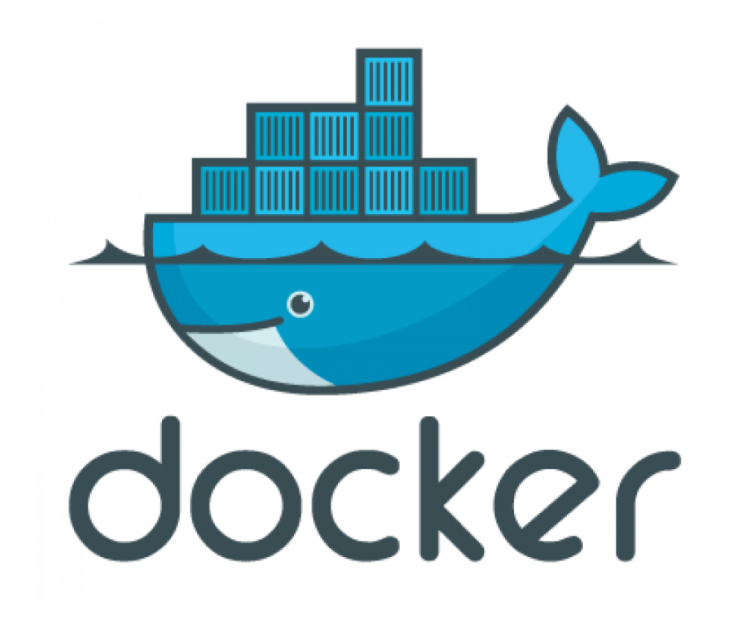

# Docker 



## 도커란?
> 도커는 컨테이너 기반의 오픈소스 가상화 플랫폼이다.

본인은 무슨 말인지 잘 와닿지는 않으나 이 도커를 통해 서로 다른 환경에서 프로그램이 안정적으로 돌아가게 하며 서버 세팅 / 업데이트를 용이하게 하는 도구 정도로 이해하면 될 것 같다.
## 간단한 도커 사용법

(1) 컨테이너 생성

우선 컨테이너를 생성하려면 이미지가 있어야 한다.
따라서 해당 이미지가 있는지 먼저 로컬에서 찾아보고 없다면 도커 허브엣 찾아 다운로드를 한 다음 컨테이너를 생성한다. 


```
docker run -it <이미지 이름>
```

* -it 옵션은 터이널로 컨테이너 접속이 가능하게 해주는 옵션이다.

(2) 컨테이너 확인하기
``` 
docker ps -a
```

* -a 옵션은 종료된 컨테이너까지 출력한다.

(3) 컨테이너 재실행

``` 
docker start -ai <컨테이너 ID>
```

* -ai 옵션은 터미널로 컨테이너 접속이 가능하게 해준다.
  
(4) 컨테이너 삭제하기 

``` 
docker rm <컨테이너 ID>
```


